# MerlynCAM

## Introduction
This project was made possible thanks the reverse engineering efforts done by the OpenIPC team! You can check out their supported hardware here: https://openipc.org/supported-hardware/featured and the reference project here: https://oshwlab.com/oshwhub.com/openipc-vtx-ssc338q-30kq

This is my custom action camera, the MerlynCAM! This project was made to record HD footage on my FPV drones. It records video at 1080p@90, 1440p@60 and 4k@20. It also includes a BMI270 gyro to log motion data at 150Hz for Gyroflow video stabilization, and an ICS-43434 I2S microphone to capture propeller noise for extra immersion.

The MerlynCAM is powered by the Sigmastar SSC338Q SOC. It is easy to use and includes an auxiliary low power microcontroller to manage the user interface. It handles single button power on and recording, auto power on when external voltage is detected, and battery level monitoring. It has an internal 1S battery with a BQ25606 charging circuit so it can be used like a normal action cam, or with the batteries removed to save weight on a drone.

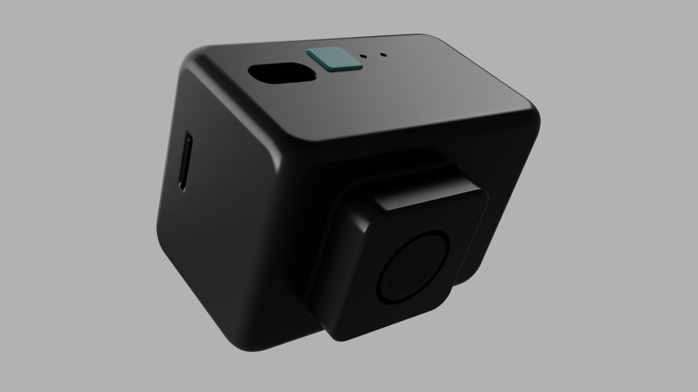
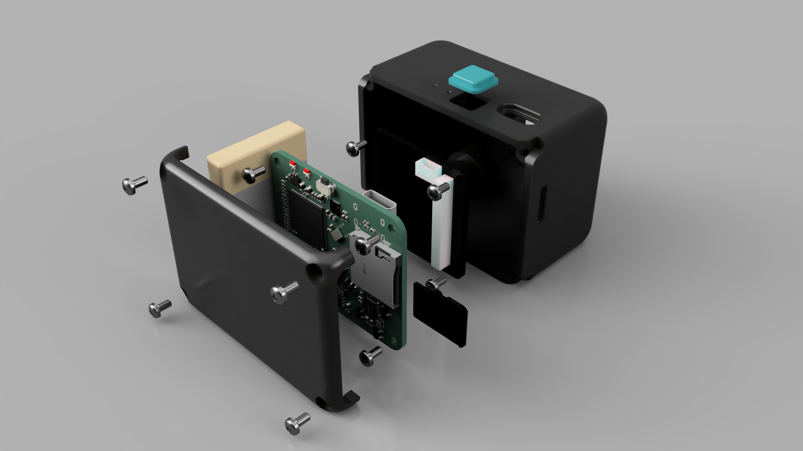
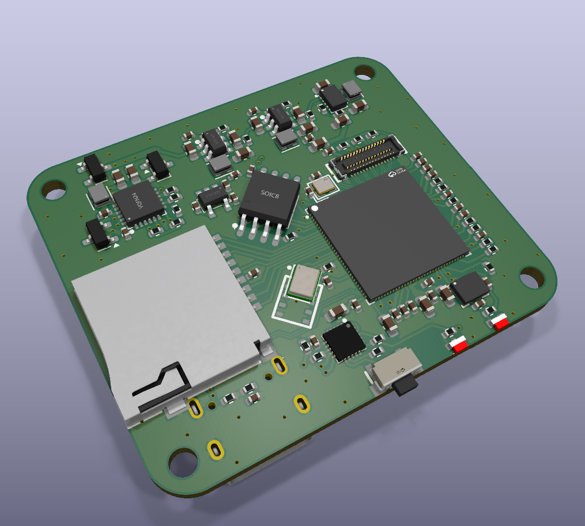
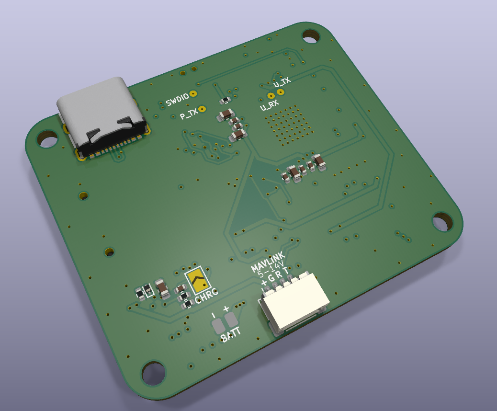

## User Guide
The MerlynCAM operates using a single button and shows charge status and battery levels using a White LED

### Power & Recording Control
- **Power On:** Press the button once, then press and hold for 2 seconds. The White LED will blink rapidly while holding, then turn solid to indicate it is booting. Release the button.

> [!TIP]
> The camera will refuse to power on if the battery is below 5%

- **Power Off:** Press and hold the button for 4 seconds. The White LED will blink rapidly after 2 seconds, then blink twice and turn off.

- **Start/Stop Recording:** While the camera is powered on, hold the button for 1 second to start recording. Hold for 1 second again to stop recording.

### Battery Level Checking
While powered off, press the button once. The White LED will blink to indicate the current charge level:

- **\>95%:** 4 normal blinks + 3 rapid blinks
- **80-95%** 4 blinks
- **60-79%:** 3 blinks
- **40-59%:** 2 blinks
- **20-39%:** 1 blink
- **\< 5%:** 3 rapid blinks

### Passive Indicator
- **Charging:** The White LED will pulse slowly
- **Battery Status:** The White LED automatically flashes the current battery percentage every 3.5 seconds
- **Recording:** The Red LED flashes every 1 second

> [!IMPORTANT]
> Bridge the CHRG pad on the PCB if no battery is connected. This is necessary for the battery management IC to output a stable voltage on external power.

## Hardware Specifications
* **SOC:** Sigmastar SSC338Q
* **Camera Interface:** 30 pin mezzanine connector (Orange Pi 5 compatible)
* **IMU:** BMI270 @ I2C
* **Microphone:** ICS-43434 @ I2S
* **Storage:** Micro SD Card slot + W25Q128JVSIQ 16MB NOR Flash
* **Power Management & User Interface:** CH32V003F4U6
* **Battery Management:** BQ25606
* **Power Supply:** TPS63802 buck boost (3.3V), RT8097CHGE buck (1.0V and 1.5V), RT9193-18GB LDO (1.8V)

## Hardware Overview
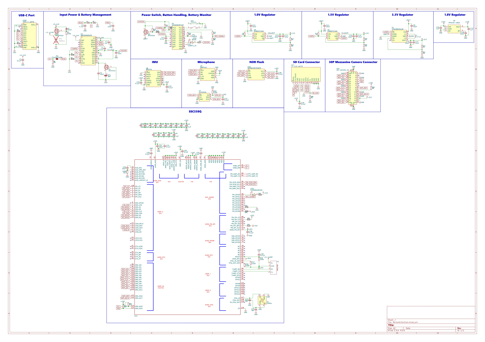
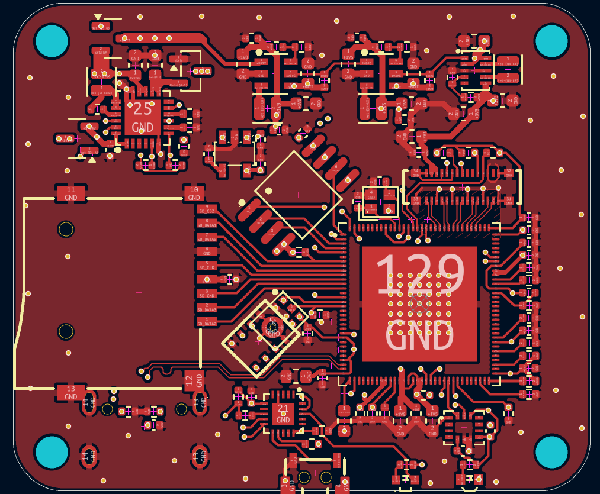
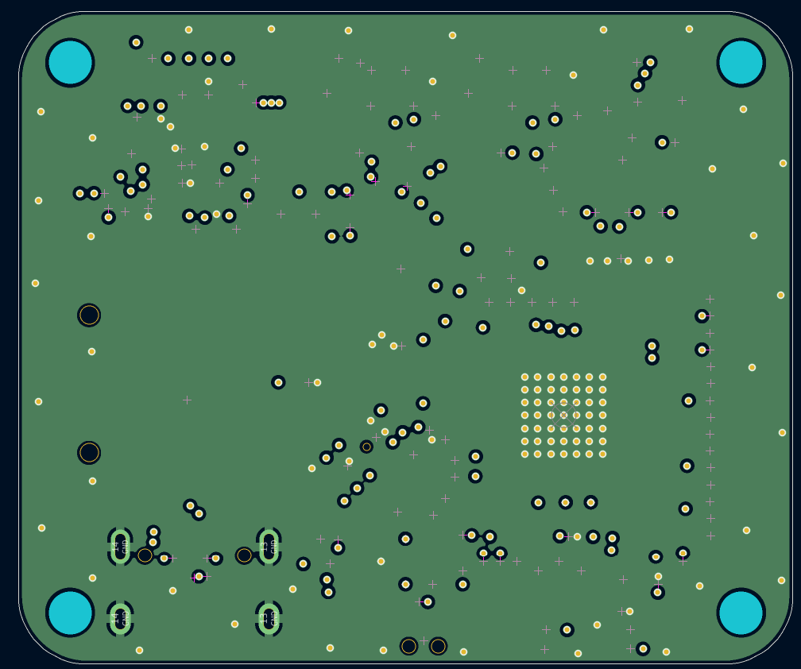
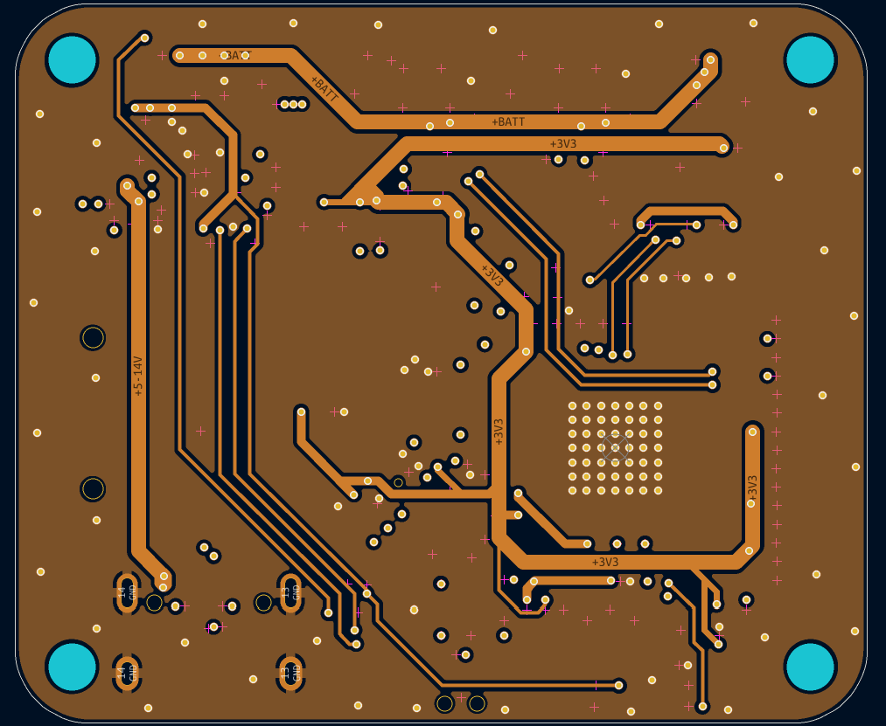
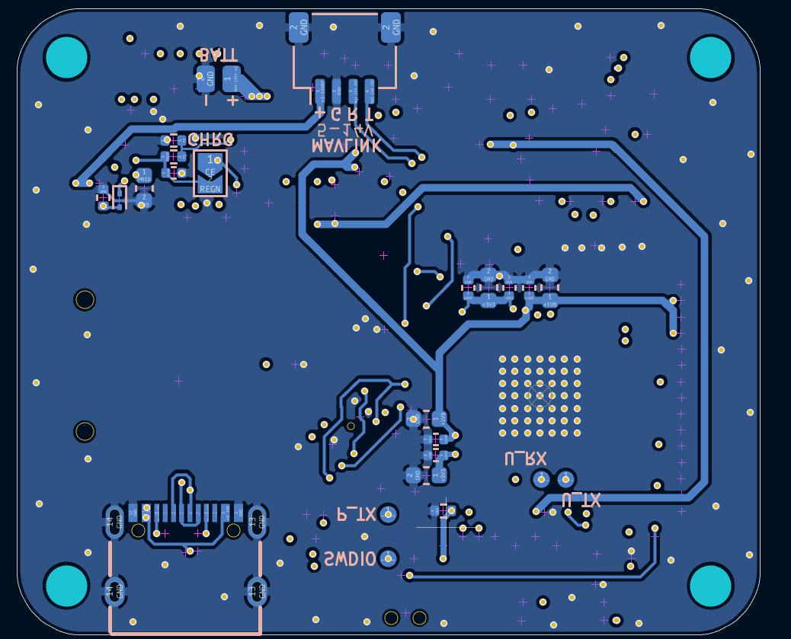
> [!WARNING]
> When ordering from JLCPCB, make sure to enable impedance control and use the JLC04161H-3313 Stackup 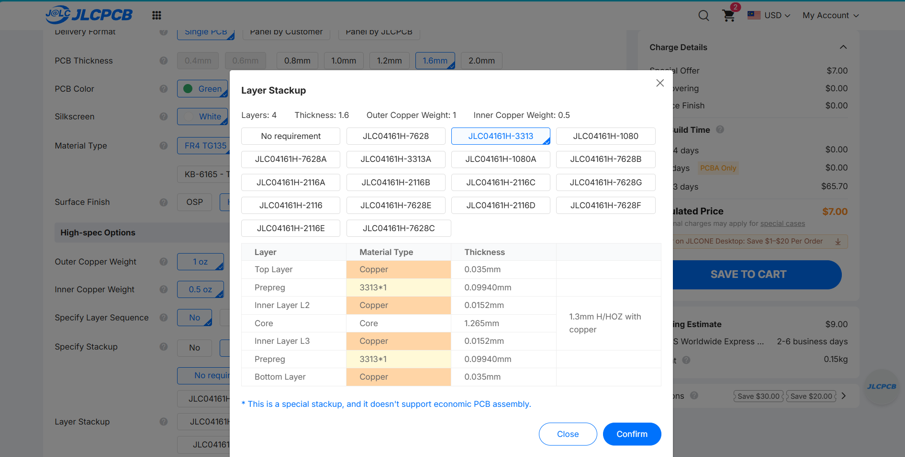

## Firmware
Because the SSC338Q is a proprietary chip, it must run the OpenIPC linux environment. Building the firmware requires a linux filesystem (Windows isn't supported)

> [!WARNING]
> At least 20GB of free space is required to build OpenIPC

### How to build the firmware (SSC338Q)
1. Clone the OpenIPC [firmware repository](https://github.com/openipc/firmware)
2. Run `make` and select the infinity6e architecture on the TUI.
3. Navigate to `output/build/linux-custom/arch/arm/boot/dts/` and replace `infinity6e-ssc012b-s01a.dts` with [infinity6e-ssc012b-s01a.dts](https://github.com/YeetTheAnson/MerlynCAM/blob/main/firmware/source/openIPC/infinity6e-ssc012b-s01a.dts).
4. Run `make linux-rebuild` to update the custom DTS changes into the kernel.
5. Navigate to `output/build/images` and extract `openipc.ssc338q-nand-ultimate.tgz` by entering `tar -xzf openipc.ssc338q-nand-ultimate.tgz`
6. Navigate to ssc338q-nand-ultimate and enter the command in your terminal
 `dd if=uImage.ssc338q of=openipc-ssc338q-nor-ultimate-16mb.bin bs=1K seek=384 conv=notrunc` and the binary file should appear

### How to build the firmware (CH32V003)
1. Clone [this repository](https://github.com/YeetTheAnson/MerlynCAM/tree/main) and enter the directory `cd MerlynCAM`
2. Open the `/firmware/source/powerManagement/powerManagement.ino` file in ArduinoIDE
3. Paste `https://alexandermandera.github.io/arduino-wch32v003/package_ch32v003_index.json` into File > Preferences > Additional boards manager URLs
4. Go to boards manager and install `WCH Boards` by Alexander Mandera
5. Click the upload button or Sketch > Export Compiled Binary

### How to flash the firmware (SSC338Q)
The W25Q128 16MB flash chip comes blank from the factory and the bootloader must be flashed before the operating system is able to boot.
1. Connect the CH341A USB programmer or a makeshift Arduino programmer to flash the binary file to the W25Q128 flash chip. The file can be obtained in [firmware/binaries/(SSC338Q)openipc-nor-ultimate-16mb.bin](https://github.com/YeetTheAnson/MerlynCAM/blob/main/firmware/binaries/(SSC338Q)openipc-nor-ultimate-16mb.bin) or the [OpenIPC repository](https://openipc.org/cameras/vendors/sigmastar/socs/ssc338q/download_full_image?flash_size=16&flash_type=nor&fw_release=ultimate&layout=16) or compiled locally.

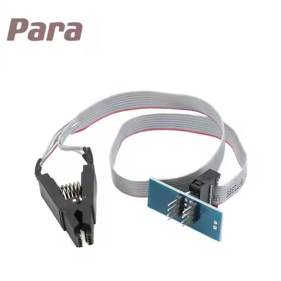

### How to flash the firmware (CH32V003)
1. Connect the WCH Link USB adapter to the SWDIO test point
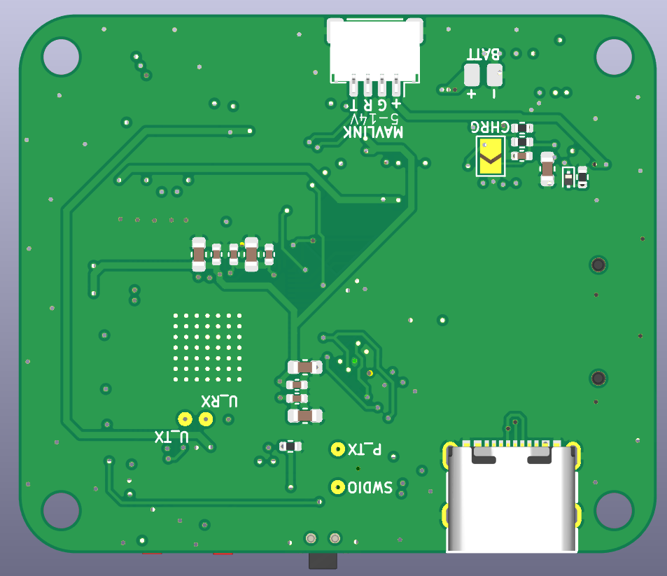
2. Connect the USB C port. The MerlynCAM PCB and WCH Link USB adapter must share common ground (e.g. connected to the same laptop)
3. If compiling locally, press the upload button in Arduino IDE. Or use WCH-LinkUtility if flashing the pre compile binary in [/firmware/binaries/(CH32V003)powerManagement.hex](https://github.com/YeetTheAnson/MerlynCAM/blob/main/firmware/binaries/(CH32V003)powerManagement.hex)

## Bill of Material

| Category | Item Name | Description | Link | Vendor | Quantity | Total Price (USD) |
|---|---|---|---|---|---:|---:|
| PCB Components | CL10A106MA8NRNC | 10uF 0603 capacitor | [link](https://www.lcsc.com/product-detail/C96446.html) | LCSC | 20 | 1.30 |
| PCB Components | CL05A475MP5NRNC | 4.7uF 0402 capacitor | [link](https://www.lcsc.com/product-detail/C23733.html) | LCSC | 50 | 1.17 |
| PCB Components | CL05B104KB54PNC | 0.1uF 0402 capacitor | [link](https://www.lcsc.com/product-detail/C307331.html) | LCSC | 100 | 0.89 |
| PCB Components | CC0402KRX7R9BB473 | 47nF 0402 capacitor | [link](https://www.lcsc.com/product-detail/C272875.html) | LCSC | 100 | 0.41 |
| PCB Components | CL05A105KA5NQNC | 1uF 0402 capacitor | [link](https://www.lcsc.com/product-detail/C52923.html) | LCSC | 50 | 0.61 |
| PCB Components | CL10A226MQ8NRNC | 22uF 0603 capacitor | [link](https://www.lcsc.com/product-detail/C59461.html) | LCSC | 20 | 0.63 |
| PCB Components | 0402B223K500NT | 22nF 0402 capacitor | [link](https://www.lcsc.com/product-detail/C1532.html) | LCSC | 50 | 0.58 |
| PCB Components | 0402CG8R0C500NT | 8pF 0402 capacitor | [link](https://www.lcsc.com/product-detail/C1578.html) | LCSC | 100 | 0.36 |
| PCB Components | CDZVT2R5.1B | 5.1V Clamp SOD923 zener | [link](https://www.lcsc.com/product-detail/C414245.html) | LCSC | 20 | 0.64 |
| PCB Components | HC-1.0-4PWT | 4P JST-SH connector | [link](https://www.lcsc.com/product-detail/C2845363.html) | LCSC | 5 | 0.47 |
| PCB Components | FTC201610S1R5MBCA | 1.5uH 0806 inductor | [link](https://www.lcsc.com/product-detail/C5832343.html) | LCSC | 10 | 0.98 |
| PCB Components | FTC201610SR47MBCA | 0.47 uH 0806 inductor | [link](https://www.lcsc.com/product-detail/C5832340.html) | LCSC | 10 | 0.98 |
| PCB Components | YLED0602RSIDE | Red 0602 right angle LED | [link](https://www.lcsc.com/product-detail/C49446796.html) | LCSC | 20 | 0.49 |
| PCB Components | YLED0602WSIDE | White 0602 right angle LED | [link](https://www.lcsc.com/product-detail/C46635136.html) | LCSC | 50 | 0.99 |
| PCB Components | AO3401A | P channel MOSFET | [link](https://www.lcsc.com/product-detail/C15127.html) | LCSC | 5 | 0.49 |
| PCB Components | 0402WGF1003TCE | 100k 0402 resistor | [link](https://www.lcsc.com/product-detail/C25741.html) | LCSC | 100 | 0.28 |
| PCB Components | FRC0402F2700TS | 270R 0402 resistor | [link](https://www.lcsc.com/product-detail/C2909342.html) | LCSC | 100 | 0.25 |
| PCB Components | FRC0402F9100TS | 910R 0402 resistor | [link](https://www.lcsc.com/product-detail/C2909392.html) | LCSC | 100 | 0.18 |
| PCB Components | 0402WGF1002TCE | 10k 0402 resistor | [link](https://www.lcsc.com/product-detail/C25744.html) | LCSC | 100 | 0.31 |
| PCB Components | 0402WGF5101TCE | 5.1k 0402 resistor | [link](https://www.lcsc.com/product-detail/C25905.html) | LCSC | 100 | 0.26 |
| PCB Components | 0402WGF5602TCE | 56k 0402 resistor | [link](https://www.lcsc.com/product-detail/C25796.html) | LCSC | 100 | 0.68 |
| PCB Components | 0402WGF1502TCE | 15k 0402 resistor | [link](https://www.lcsc.com/product-detail/C25756.html) | LCSC | 100 | 0.58 |
| PCB Components | FRC0402F3602TS | 36k 0402 resistor | [link](https://www.lcsc.com/product-detail/C2930004.html) | LCSC | 100 | 0.19 |
| PCB Components | 0402WGF1000TCE | 100R 0402 resistor | [link](https://www.lcsc.com/product-detail/C25076.html) | LCSC | 100 | 0.77 |
| PCB Components | 0402WGF5102TCE | 51k 0402 resistor | [link](https://www.lcsc.com/product-detail/C25794.html) | LCSC | 100 | 0.19 |
| PCB Components | 0402WGF4701TCE | 4.7k 0402 resistor | [link](https://www.lcsc.com/product-detail/C25900.html) | LCSC | 100 | 0.29 |
| PCB Components | 0402WGF2003TCE | 200k 0402 resistor | [link](https://www.lcsc.com/product-detail/C25764.html) | LCSC | 100 | 0.32 |
| PCB Components | TS24CA | Right angle button | [link](https://www.lcsc.com/product-detail/C393942.html) | LCSC | 20 | 0.51 |
| PCB Components | TPS63802DLAR | Buck boost converter | [link](https://www.lcsc.com/product-detail/C2845237.html) | LCSC | 2 | 2.05 |
| PCB Components | BQ25606RGER | Battery charge and management | [link](https://www.lcsc.com/product-detail/C374063.html) | LCSC | 1 | 1.63 |
| PCB Components | RT8097CHGE | Buck converter | [link](https://www.lcsc.com/product-detail/C3031673.html) | LCSC | 5 | 0.80 |
| PCB Components | CH32V003F4U6 | CH32 for interface and power management | [link](https://www.lcsc.com/product-detail/C5299908.html) | LCSC | 5 | 1.58 |
| PCB Components | RT9193-18GB | 1.8V Linear LDO regulator | [link](https://www.lcsc.com/product-detail/C27416.html) | LCSC | 5 | 0.83 |
| PCB Components | ICS-43434 | I2S MEMS microphone | [link](https://www.lcsc.com/product-detail/C5656610.html) | LCSC | 1 | 4.13 |
| PCB Components | BMI270 | IMU | [link](https://www.lcsc.com/product-detail/C2836813.html) | LCSC | 1 | 3.25 |
| PCB Components | W25Q128JVSIQ | 16 MB NOR flash | [link](https://www.lcsc.com/product-detail/C97521.html) | LCSC | 1 | 2.62 |
| PCB Components | TF-115-BCP9 | SD card connector | [link](https://www.lcsc.com/product-detail/C720505.html) | LCSC | 5 | 0.49 |
| PCB Components | TYPE-C 16PIN 2MD(073) | TYPE C Connector | [link](https://www.lcsc.com/product-detail/C2765186.html) | LCSC | 20 | 1.49 |
| PCB Components | T201624MBBCE2X | 24MHz 2016 crystal resonator | [link](https://www.lcsc.com/product-detail/C7303340.html) | LCSC | 10 | 0.71 |
| PCB | PCB | Bare PCB | - | JLCPCB | 1 | 7.00 |
| PCB | Stencil | Stencil | - | JLCPCB | 1 | 10.45 |
| PCB | JLCPCB Shipping | Shipping (No idea how this is cheaper than E post. Will check again after) | - | UPS Saver | 1 | 9.18 |
| Parts | OK-10F030-04 | 30P 0.4mm Mezzanine connector | [link](https://www.aliexpress.com/item/1005008289234567.html) | AliExpress | 1 | 2.09 |
| Parts | SSC338Q | Main recording SOC | [link](https://www.aliexpress.com/item/1005009947110808.html) | AliExpress | 1 | 16.99 |
| Parts | IMX415 camera module | IMX415 camera module 140 FOV | [link](https://www.aliexpress.com/item/1005009005078802.html) | AliExpress | 1 | 32.69 |
| Parts | AliExpress Shipping | Shipping | - | AliExpress | 1 | 9.74 |

### **Grand Total:** \$123.52